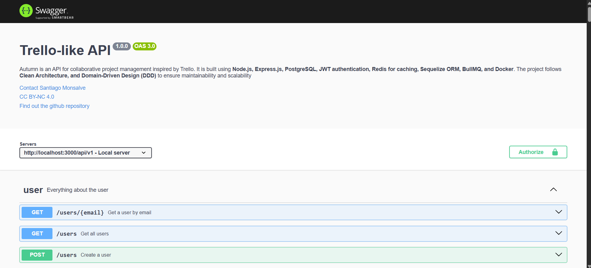
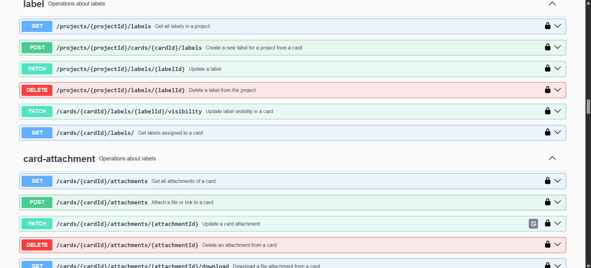

# Autumn(Trello-like API)

Autumn is an API for collaborative project management inspired by Trello. It is built using **Node.js, Express.js, PostgreSQL, JWT authentication, Redis for caching, Sequelize ORM, BullMQ, and Docker**. The project follows **Clean Architecture, and Domain-Driven Design (DDD)** to ensure maintainability and scalability. It features authentication management, roles, teams, tasks, attachments, and more.


## Table of Contents

- [Documentation API](#documentation-api)
- [User Testing Flow (via Swagger UI)](#user-testing-flow-via-swagger-ui)
- [Technologies Used](#technologies-used)
- [Authentication System](#authentication-system)
- [Project Structure](#project-structure)
- [📦 Features](#-features)
- [🔐 Authentication and roles](#-authentication-and-roles)
- [🧪 Testing](#-testing)
- [How to Run the Project](#how-to-run-the-project)
  - [Prerequisites](#prerequisites)
  - [Setup and Installation](#setup-and-installation)
- [Available Scripts](#available-scripts)
- [ER schema of the database](#er-schema-of-the-database)
- [Project Status](#project-status)
- [Upcoming implementations](#upcoming-implementations)
- [📤 API Example Requests & Responses](#-api-example-requests--responses)
- [Developer](#developer)
- [License](#license)

## Documentation API

The API documentation is available through **Swagger UI**, providing an interactive interface to explore and test the endpoints.
### Access in Production
- Visit the following URL to access the Swagger documentation:  
  [Swagger UI - Production](https://trello-like-project-api.onrender.com/api-docs)  
  Ensure to set the server to: `https://trello-like-project-api.onrender.com/api/v1/` - Remote server.

### Access in Development
- When running the project locally, you can access the Swagger documentation at:  
  [Swagger UI - Development](http://localhost:3000/api-docs)  
  Ensure to set the server to: `http://localhost:3000/api/v1/` - Local server.

- If you specify a different port in the `.env` file (other than `3000`), the local backend URL will change accordingly. For example, if the port is set to `4000`, the Swagger documentation will be available at:  
  And the server should be set to: `http://localhost:4000/api/v1/`.

Swagger UI offers a user-friendly way to test the API endpoints, view request/response formats, and understand the available features.

Here you can see a preview of the Swagger documentation:



## User Testing Flow (via Swagger UI)

This section guides you through the basic flow to test the API step by step using Swagger UI. It assumes no frontend is available, and all actions will be performed through the documented endpoints.

### 1. Sign Up
**Endpoint:** `POST /api/v1/users/`  
Create a new user by providing the required fields. After registration, a verification email is automatically sent to the registered email address.

### 2. Email Verification
This is a required step after sign-up.

- Copy the token from the email and paste it into the lock icon (top-right in Swagger UI) as a Bearer Token.
- Then call: `POST /auth/verify-email`

If you did not receive the email or need to resend it, you can use:
- `POST /auth/send-verification-email` — to send again.
- `POST /auth/resend-verification-email` — recommended when integrating with a frontend for safer resend control.

### 3. Password Recovery (if needed)
If you forget your password:
1. Send a verification email to your registered email:  
  `POST /auth/send-verification-email`
2. Copy the token from the email and verify it:  
  `POST /auth/verify-email-to-recover-password` (use lock icon for Bearer token)
3. Update your password:  
  `PATCH /auth/password`
4. Log in again:  
  `POST /auth/login` → You'll receive an accessToken.

### 4. Authentication & Token Handling
- Use the accessToken received from `POST /auth/login` in all subsequent endpoints (starting from `/workspaces`).
- Paste the accessToken in the Swagger UI lock icon.
- The token is valid for 1 hour. After that:
  - You can log in again, or
  - Refresh your token using:  
   `POST /auth/refresh-tokens` (uses cookie-stored refreshToken and returns a new accessToken)

💡 In a frontend application, this token would be passed via the Authorization header using the Bearer scheme.

### 5. Create Workspace & Project
1. Create a workspace:  
  `POST /workspaces`
2. Create a project (required to interact with the system):  
  `POST /workspaces/{workspaceId}/projects`  
  Optionally, set a background image URL.
3. To update the background after creation:  
  `PATCH /workspaces/{workspaceId}/projects/{projectId}/background`

  ### Quick Start for Testing the API

  If you want to test the API quickly, you can skip the steps related to adding members and managing teams. These features are entirely optional and depend on how you intend to use the system. To get started right away, jump directly to **Step 8** to begin creating lists and cards. This allows you to explore the core functionality of the API without additional setup. Perfect for quick testing in Swagger UI!

### 6. Invite Members
1. Add a member to the workspace:  
  `POST /workspaces/{workspaceId}/members`
2. Add that member to the project:  
  `POST /workspaces/{workspaceId}/projects/{projectId}/members`

### 7. Teams (Optional)
If you'd like to work with teams:
1. Create a team:  
  `POST /workspaces/{workspaceId}/teams`
2. Add members to the team:  
  `POST /workspaces/{workspaceId}/teams/{teamId}/members`  
  (Only members already in the workspace can be added to teams or projects.)
3. Assign a project to the team:  
  `POST /workspaces/{workspaceId}/teams/{teamId}/projects/{projectId}`  
  This will automatically add any missing team members to the project.

### 8. Create Lists & Cards
1. Create a list:  
  `POST /workspaces/{workspaceId}/projects/{projectId}/lists`
2. Create a card within a list:  
  `POST /lists/{listId}/cards`  
  (Cards can represent tasks, goals, or phases — up to the user's definition.)

### 9. Card Management
1. Assign members to cards:  
  `POST /cards/{cardId}/members/{projectMemberId}`  
  (Only members of the project can be assigned.)
2. Create labels (e.g., In Progress, Completed):  
  `POST /projects/{projectId}/cards/{cardId}/labels`
3. Optionally change label visibility:  
  `PATCH /cards/{cardId}/labels/{labelId}/visibility`
4. Add attachments (files or images):  
  `POST /cards/{cardId}/attachments`

### 10. Checklists
1. Create a checklist inside a card:  
  `POST /cards/{cardId}/checklists`
2. Duplicate a checklist from another card in the same project:  
  `POST /cards/{cardId}/checklists/{checklistId}/copy`
3. Add checklist items:  
  `POST /cards/{cardId}/checklists/{checklistId}/checklist-items`  
  (Optionally assign members during creation)
4. Assign more members to a checklist item:  
  `POST /checklists/{checklistId}/checklist-items/{checklistItemId}/members`  
  (If member already assigned, the response will return an empty array.)

### 11. Project Overview
1. Get a full overview of your board:  
  `GET /workspaces/projects/{projectId}/board`
2. Get detailed information about a specific card:  
  `GET /lists/{listId}/cards/{cardId}/information`

### Additional Capabilities (Advanced Use Cases)
The system supports advanced features such as:
- Transferring ownership of workspaces, projects, or teams.
- Promoting or demoting member roles.
- Removing teams from projects with options to keep or remove team members from that project.

---

## Technologies Used
- **Node.js** - Backend runtime
- **Express.js** - Web framework
- **PostgreSQL** - Database
- **Sequelize ORM** - Object-Relational Mapping
- **Redis** - Caching system
- **JWT Authentication** - Secure authentication(Access/Refresh tokens)
- **Passport.js** - Authentication middleware
- **Docker** - Containerized environment
- **Winston & Morgan** - Logging and performance monitoring
- **Nodemailer** - Email service
- **Joi** - Data validation
- **Express-rate-limit** - Rate limiting middleware
- **BullMQ** - Task queue for sending emails in the background
- **Cloudinary** - Host files and images for free
- **Swagger** - API documentation
- **PM2** - Management of production processes

## Authentication System
Autumn implements a **JWT-based authentication system** with access and refresh tokens. A key feature of this system is **auto-authentication**: as long as the refresh token remains valid, the user session remains active indefinitely. However, if the user does not log in for **15 consecutive days**, the refresh token will expire and and re-authentication will be required.

## Project Structure
The project follows **Clean Architecture and Domain-Driven Design (DDD)** principles. The `api/src/` directory is structured as follows:
```
api/src/
├── application/
│   ├── dtos/
│   ├── services/
│   └── use-cases/
├── domain/
│   ├── repositories/ (contracts)
│   ├── entities/
│   └── value-objects/
├── infrastructure/
│   ├── adapters/
|   ├── queues/
│   ├── repositories/ (implementations)
│   └── store/ (DB, ORM, cache configuration)
├── interfaces/
│   ├── controllers/
│   ├── middlewares/
│   ├── routes/
│   └── schemas/
├── config/ (environment variables)
└── utils/ (helpers)
```

## 📦 Features

- ✅ Authentication with JWT (access/refresh tokens)
- ✅ Validation with Joi
- ✅ Global Error Middleware
- ✅ Authentication and authorization middleware
- ✅ Clean Architecture + DDD
- ✅ Full CRUD::
- Users (with recursive deletion)
- Workspaces, Projects, and Teams
- Lists, Cards, Checklists, and Items
- Members, Labels, and Attachments
- ✅ User roles by context belonging to workspaces, projects or teams: `owner`, `admin`, `member`
- ✅ Roles per subscription plan: `basic`, `premium`
- ✅ Assigning/de-assigning equipment to projects
- ✅ Securely upload files and images with Cloudinary
- ✅ Secure download via proxy endpoint with streams
- ✅ Message queues with BullMQ for sending emails

---

## 🔐 Authentication and roles

- **JWT Authentication** with refresh tokens managed from Redis and cookies.
- **Subscription plans**:
  - `basic`: Creation and limited membership of workspaces, projects, and teams
  - `premium`: Limited but expanded ability to create and join workspaces, projects, and teams.
- **Hierarchical roles** by entity (`workspace`, `project`, `team`):
  - `owner`: owner (can transfer ownership)
  - `admin`: manage members
  - `member`: You can only contribute to the project with lists, cards, and information within each card, but you cannot manage members or update the project.

---

## 🧪 Testing

Currently **automated tests are not included**, but functionality has been verified with extensive manual testing.

> Different testing techniques will be implemented soon.

---

## How to Run the Project
### Prerequisites
- **Docker** installed on your machine
- **Node.js** and **npm** installed
- Have a **Redis account** or download a redis image with docker in the .yml file
- Have a **Cloudinary account**
- For email sending to work, you need a **Gmail password**. You can access it at https://myaccount.google.com/apppasswords. It will give you a password like: abcd efg hijkl. Remove the spaces and paste it into the .env file in SMT_PASS.


### Setup and Installation
1. Clone the repository:
   ```bash
   git clone git@github.com:OscarS05/Trello-like-project.git
   cd Trello-like-project
   ```
2. Create a **.env** file based on the `.env.example` provided in the project root
3. Start the services using Docker Compose:
   ```bash
   docker-compose up -d
   ```
4. Install dependencies:
   ```bash
   npm install --legacy-peer-deps
   ```
5. Run database migrations:
   ```bash
   npm run migrations:run
   ```
6. Start the development server:
   If you have already registered, can log in successfully and you do not have to send emails:
   ```bash
   npm run dev
   ```

    or,

   If you need user registration with email confirmation:
   ```bash
   npm run pm2
   ```

## Available Scripts
```bash
"scripts": {
  "pm2": "pm2 start ecosystem.config.js",
  "dev": "nodemon api/index.js",
  "start": "node api/index.js",
  "lint": "eslint",
  "migrations:generate": "sequelize-cli migration:generate --name",
  "migrations:run": "sequelize-cli db:migrate",
  "migrations:revert": "sequelize-cli db:migrate:undo",
  "migrations:delete": "sequelize-cli db:migrate:undo:all",
  "migrations:status": "sequelize-cli db:migrate:status"
}
```

## ER schema of the database
The file with the ER diagram is located in the root of the project:
 - Trello-like-api-db-schema.drawio
To edit it, install the "Draw.io Integration" extension in VSCode.
If the diagram doesn't display, right-click on the file → "Reopen Editor With" → "Draw.io".

If you want to view the .png image of the database's ER schema, you must view it from the GitHub repository because it cannot be viewed properly in VSC.

## Project Status
The project is completed.
All backend functionalities have been implemented successfully.
It runs locally with tools like Insomnia or Postman.


## Upcoming implementations

- **Real-time notification system**.
- **Real-time chat for projects using Socket.io**.
- **Comprehensive testing implementation**.

---

**Note**
The authentication system, along with the creation of lists and cards, is part of the Software Analysis and Development Technologist (SENA) certification. The rest of the project was a voluntary and self-taught creation after SENA.

---

## 📤 API Example Requests & Responses

Below are sample requests and responses for key endpoints in the API. These examples demonstrate how authentication, data retrieval, and resource creation work in the system.

---

### 🔐 1. User Login

**`POST /api/v1/auth/login`**  
Authenticate a user with their email and password. A successful login returns an access token and sets a secure refresh token cookie.

#### Request
body:
```bash
{
  "email": "johndoe@example.com",
  "password": "O123456@k"
}
```

#### Response

body:
```bash
{
  "accessToken": "eyJhbGciOiJIUzI1NiIsInR5cCI6IkpXVCJ9..."
}
```

Set-cookie(Header):
```bash
refresh-token: eyJhbGciOiJIUzI1NiIsInR5cCI6IkpXVCJ9...
```


### 🔐 2. Get Full Card Information

**`GET /api/v1/lists/:listId/cards/:cardId/information`**  
Retrieve detailed information about a specific card, including its metadata, labels, members, attachments, and checklists.

- 🛡️ Authentication Required: Bearer token
- 🔒 Access Control:
  - If the project is private, the requester must be a project member.
  - If project visibility is workspace, any workspace member can access.
  - Returns 403 Forbidden or 404 Not Found as appropriate.

#### Request
body:
```bash
GET /api/v1/lists/7427d184-3a63-4995-9b5d-9862357ed2db/cards/6da5bc61-8590-4db3-a497-6b4a006c2064/information
```

#### Response

body:
```bash
{
  "card": {
    "id": "3fa85f64-5717-4562-b3fc-2c963f66afa6",
    "name": "string",
    "description": "string",
    "listId": "3fa85f64-5717-4562-b3fc-2c963f66afa6",
    "createdAt": "2025-05-02T16:37:17.921Z",
    "labels": [
      {
        "id": "28436f1c-b90e-4b0d-815f-0ad9016ce92b",
        "name": "Not started",
        "color": "#FFFFFF",
        "projectId": "9c8b7e8a-394a-4e47-8f8f-9e66fa4e3a6b",
        "isVisible": true
      }
    ],
    "cardMembers": [
      {
        "id": "3fa85f64-5717-4562-b3fc-2c963f66afa6",
        "projectMemberId": "3fa85f64-5717-4562-b3fc-2c963f66afa6",
        "userId": "3fa85f64-5717-4562-b3fc-2c963f66afa6",
        "name": "Juanita"
      }
    ],
    "attachments": [
      {
        "id": "dbb98467-81ad-4018-90f6-cbf581eac82d",
        "filename": "Agroplus-db-scheme.jpg",
        "url": "https://res.cloudinary.com/dfprxzekh/image/upload/v1744326304/card-attachments/file_ysjlp7.jpg",
        "cardId": "1a8ad354-e5bb-49f7-95b3-5cdfa0533233",
        "type": "image/jpeg",
        "createdAt": "2025-04-10T23:05:04.884Z"
      }
    ],
    "checklists": [
      {
        "id": "b818e9a7-0eed-4556-89c0-d3c8b9352cfd",
        "name": "Task 2",
        "cardId": "449f8ab9-1f3a-4d7d-af3d-40be1a8958eb",
        "createdAt": "2025-04-12T02:37:49.832Z",
        "items": [
          {
            "id": "3fa85f64-5717-4562-b3fc-2c963f66afa6",
            "name": "item 1",
            "checklistId": "3fa85f64-5717-4562-b3fc-2c963f66afa6",
            "isChecked": true,
            "dueDate": "2025-05-02T16:37:17.921Z",
            "createdAt": "2025-05-02T16:37:17.921Z",
            "members": [
              {
                "id": "3fa85f64-5717-4562-b3fc-2c963f66afa6",
                "projectMemberId": "3fa85f64-5717-4562-b3fc-2c963f66afa6",
                "name": "Juanita"
              }
            ]
          }
        ]
      }
    ]
  }
}
```

### 🔐 3. Assign Members to a Checklist Item

**`POST /api/v1/checklists/{checklistId}/checklist-items/{checklistItemId}/members `**  
Assign one or more project members to a specific checklist item in a single request, improving performance and reducing latency.

- 🛡️ Authentication Required: Bearer token
- 🔒 Validation:
  - All parameters must be valid UUIDs.
  - Requester must be a project member.
  - All projectMemberIds must belong to the project.

#### Request
body:
```bash
{
  "projectMemberIds": [
    "8942a2d8-02c8-464e-8a9a-2d5b8c839ea3",
    "26de1037-0474-4e11-bca1-ec344376744b"
  ]
}
```

#### Response

body:
```bash
{
  "checklistItemMemberAdded": [
    {
      "id": "93cb4c3c-c9c4-420d-8d2e-0268b74036b0",
      "name": "lilo",
      "checklistItemId": "327c2217-6383-4305-b20a-ca6d9cb1758d",
      "projectMemberId": "26de1037-0474-4e11-bca1-ec344376744b",
      "addedAt": "2025-04-09T00:57:42.282Z"
    },
    {
      "id": "93cb4c3c-c9c4-420d-8d2e-0268b74036b0",
      "name": "juanita",
      "checklistItemId": "327c2217-6383-4305-b20a-ca6d9cb1758d",
      "projectMemberId": "26de1037-0474-4e11-bca1-ec344376744b",
      "addedAt": "2025-04-09T00:57:42.282Z"
    }
  ]
}
```

---


## Developer
 - [Oscar Santiago Monsalve](https://github.com/OscarS05)
---

## License
This project is licensed under the [Creative Commons BY-NC 4.0 License](https://creativecommons.org/licenses/by-nc/4.0/).

[](https://creativecommons.org/licenses/by-nc/4.0/)

